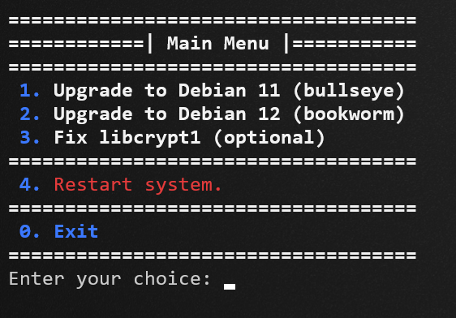

# Debian Upgrader Script (buster, bookworm, bullseye) with basic menu

### It's a basic bash script that helps you with the upgrade process.
What it does:
- Sets up the repositories
- Checks for some errors in certain config files
- Starts the upgrade
- Checks for current OS version
- Cheks for pending restart after upgrade

It's good for **Debian 10 -> 11** and for **Debian 11 -> 12**

#### This is how it looks like:

It's important to run this script with elevated rights, preferably as root.
